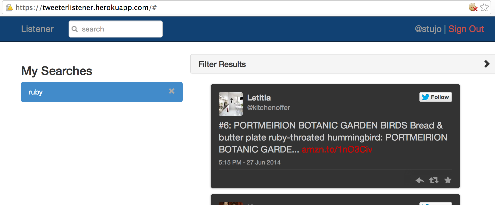
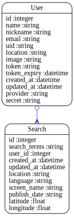

Code Review for courtney
================================================
Project: twitter_listener
================================================
#URLS

* HEROKU: __TODO__: https://XXXXX.herokuapp.com/
* GITHUB: __TODO__: https://github.com/XXXX/YYYY

# Summary

__TODO__




#Review Rubric

##Implemtation Expecations

* Models & Data Relationships
	* Expectation: At least 2 related models
	* Review: __TODO__
* Handles Invalid Data
	*  Expectation: Rails model validation for presence of necessary fields
	* Review:__TODO__
* Views & Templates	
	*  Expectation: Form partial used, but other duplication still exists
	* Review:__TODO__
* Authentication
	*  Expectation: Appropriate helper methods defined
	* Review:__TODO__
* Authorization
	* Expectation: Authorization scheme is well-thought out and used correctly.
	* Review:__TODO__
* API
	*  Expectation: An API call was made.
	* Review:__TODO__
* Testing
	*  Expectation: Includes request specs.
	* Review:__TODO__
* Heroku
	*  Expectation: Project is hosted on Heroku
	* Review:__TODO__
* JavaScript/jQuery
	* Expectation: JS/jQuery is used to handle at least one interactive event after the window loads
	* Review:__TODO__

##Code Quality Expectations

* Test Driven
	* Expectation: In addition to models, requests have been tested for valid 	responses and valid data
	* Review:__TODO__
* Flexible / extensible / scalable
	* Expectation: No database calls inside a loop
	* Review:__TODO__
* Well-commented
	* Expectation: Comments are not sporadic. Comments address the "why".
	* Review:__TODO__
* Well-formatted, Clean Project
	* Expectation: No mix of tabs and spaces
	* Review:__TODO__
* Follows naming conventions
	* Expectation: Naming follows best practices (semantic variable naming)
	* Review:__TODO__
* Secure
	* Expectation: Authorization is implemented as well as authentication.  Athorization is achieved through controller methods or helpers that limit resources
	* Review:__TODO__
* Documenting Work
	* Expectation: Public presentation of work involving key aspects of development process
	* Review:__TODO__
	


#Your Gemfile

```
source 'https://rubygems.org'


# Bundle edge Rails instead: gem 'rails', github: 'rails/rails'
gem 'rails', '4.1.1'
# Use postgresql as the database for Active Record
gem 'pg'
# Use SCSS for stylesheets
gem 'sass-rails', '~> 4.0.3'
# Use Uglifier as compressor for JavaScript assets
gem 'uglifier', '>= 1.3.0'
# Use CoffeeScript for .js.coffee assets and views
gem 'coffee-rails', '~> 4.0.0'
# See https://github.com/sstephenson/execjs#readme for more supported runtimes
# gem 'therubyracer',  platforms: :ruby

# Use jquery as the JavaScript library
gem 'jquery-rails'
# Turbolinks makes following links in your web application faster. Read more: https://github.com/rails/turbolinks
gem 'turbolinks'

# twitter omniauth for authentication
gem 'omniauth-twitter'

# twitter gem for search
gem 'twitter', '~> 5.11.0'

# adding geocoder gem for twitter location search
gem 'geocoder'

# Build JSON APIs with ease. Read more: https://github.com/rails/jbuilder
gem 'jbuilder', '~> 2.0'
# bundle exec rake doc:rails generates the API under doc/api.
gem 'sdoc', '~> 0.4.0',          group: :doc

# Spring speeds up development by keeping your application running in the background. Read more: https://github.com/rails/spring
gem 'spring',        group: :development

# adding dotenv to hide secrets, rspec, pry, factory_girl
group :development, :test do
  gem 'dotenv-rails'
  gem 'pry'
  gem 'rspec-rails'
  gem 'factory_girl_rails'
end

group :production do 
  gem 'rails_12factor'
end
# Use ActiveModel has_secure_password
# gem 'bcrypt', '~> 3.1.7'

# Use unicorn as the app server
# gem 'unicorn'

# Use Capistrano for deployment
# gem 'capistrano-rails', group: :development

# Use debugger
# gem 'debugger', group: [:development, :test]


```


#Your Schema

```
# encoding: UTF-8
# This file is auto-generated from the current state of the database. Instead
# of editing this file, please use the migrations feature of Active Record to
# incrementally modify your database, and then regenerate this schema definition.
#
# Note that this schema.rb definition is the authoritative source for your
# database schema. If you need to create the application database on another
# system, you should be using db:schema:load, not running all the migrations
# from scratch. The latter is a flawed and unsustainable approach (the more migrations
# you'll amass, the slower it'll run and the greater likelihood for issues).
#
# It's strongly recommended that you check this file into your version control system.

ActiveRecord::Schema.define(version: 20140625182455) do

  # These are extensions that must be enabled in order to support this database
  enable_extension "plpgsql"

  create_table "searches", force: true do |t|
    t.string   "search_terms"
    t.integer  "user_id"
    t.datetime "created_at"
    t.datetime "updated_at"
    t.string   "location"
    t.string   "language"
    t.string   "screen_name"
    t.string   "publish_date"
    t.float    "latitude"
    t.float    "longitude"
  end

  add_index "searches", ["user_id"], name: "index_searches_on_user_id", using: :btree

  create_table "users", force: true do |t|
    t.string   "name"
    t.string   "nickname"
    t.string   "email"
    t.string   "uid"
    t.string   "location"
    t.string   "image"
    t.string   "token"
    t.datetime "token_expiry"
    t.datetime "created_at"
    t.datetime "updated_at"
    t.string   "provider"
    t.string   "secret"
  end

end

```


#Your Schema Diagram





#Your Rspec Results

```

User
  should have a unique email (FAILED - 1)
  should have a twitter token
  should have a unique uid
  should have a uid
  should have a user name

Failures:

  1) User should have a unique email
     Failure/Error: subject2.email = email
     NameError:
       undefined local variable or method `email' for #<RSpec::Core::ExampleGroup::Nested_1:0x00000104244820>
     # ./spec/models/user_spec.rb:29:in `block (2 levels) in <top (required)>'

Finished in 0.07684 seconds
5 examples, 1 failure

Failed examples:

rspec ./spec/models/user_spec.rb:26 # User should have a unique email

Randomized with seed 36172


```


#Automated Best Practices Review Results

```


Source Codes: |===============================================================================================================================================|
/work/ga/wdi/2014/march/final_project/courtney/app/controllers/searches_controller.rb:12 - move model logic into model (@search use_count > 4)
/work/ga/wdi/2014/march/final_project/courtney/app/controllers/searches_controller.rb:93 - move model logic into model (new_search use_count > 4)
/work/ga/wdi/2014/march/final_project/courtney/app/controllers/searches_controller.rb:93 - use model association (for new_search)
/work/ga/wdi/2014/march/final_project/courtney/Gemfile:47 - remove trailing whitespace
/work/ga/wdi/2014/march/final_project/courtney/app/controllers/searches_controller.rb:17 - remove trailing whitespace
/work/ga/wdi/2014/march/final_project/courtney/app/controllers/sessions_controller.rb:9 - remove trailing whitespace
/work/ga/wdi/2014/march/final_project/courtney/app/controllers/users_controller.rb:5 - remove trailing whitespace
/work/ga/wdi/2014/march/final_project/courtney/config/routes.rb:13 - remove trailing whitespace
/work/ga/wdi/2014/march/final_project/courtney/app/views/main/index.html.erb:22 - remove trailing whitespace

Please go to http://rails-bestpractices.com to see more useful Rails Best Practices.

Found 9 warnings.

```


#Automated Code Review Results

```
Inspecting 13 files
CCCCC.CC.CCCC

Offenses:

app/controllers/application_controller.rb:8:3: C: Keep a blank line before and after private.
  private
  ^^^^^^^
app/controllers/application_controller.rb:9:5: C: Inconsistent indentation detected.
    def current_user
    ^^^^^^^^^^^^^^^^
app/controllers/application_controller.rb:13:5: C: Inconsistent indentation detected.
    helper_method :current_user
    ^^^^^^^^^^^^^^^^^^^^^^^^^^^
app/controllers/main_controller.rb:2:1: C: Extra empty line detected at body beginning.
app/controllers/main_controller.rb:4:1: C: Extra empty line detected at body beginning.
app/controllers/main_controller.rb:6:1: C: Extra empty line detected at body end.
app/controllers/main_controller.rb:7:4: C: Final newline missing.
end
   
app/controllers/searches_controller.rb:8:28: C: Use the new Ruby 1.9 hash syntax.
      format.json { render :json => @searches.as_json}
                           ^^^^^^^^
app/controllers/searches_controller.rb:8:54: C: Space missing inside }.
      format.json { render :json => @searches.as_json}
                                                     ^
app/controllers/searches_controller.rb:12:3: C: Method has too many lines. [30/10]
  def show
  ^^^
app/controllers/searches_controller.rb:17:48: C: Trailing whitespace detected.
      config.consumer_key  = ENV['TWITTER_KEY'] 
                                               ^
app/controllers/searches_controller.rb:23:65: C: Trailing whitespace detected.
    # create empty array to fill with tweets that are displayed. 
                                                                ^
app/controllers/searches_controller.rb:25:56: C: Trailing whitespace detected.
    # conditionals to load search results from twitter: 
                                                       ^
app/controllers/searches_controller.rb:26:1: C: Trailing whitespace detected.
app/controllers/searches_controller.rb:28:28: C: Use && instead of and.
    if @search.screen_name and @search.screen_name.length > 1
                           ^^^
app/controllers/searches_controller.rb:30:63: C: Redundant curly braces around a hash parameter.
      tweets = client.user_timeline("#{@search.screen_name}", {count: 200, include_rts: false})
                                                              ^^^^^^^^^^^^^^^^^^^^^^^^^^^^^^^^
app/controllers/searches_controller.rb:30:63: C: Space inside { missing.
      tweets = client.user_timeline("#{@search.screen_name}", {count: 200, include_rts: false})
                                                              ^
app/controllers/searches_controller.rb:30:94: C: Space inside } missing.
      tweets = client.user_timeline("#{@search.screen_name}", {count: 200, include_rts: false})
                                                                                             ^
app/controllers/searches_controller.rb:33:22: C: Prefer single-quoted strings when you don't need string interpolation or special symbols.
      search_regex = "^"
                     ^^^
app/controllers/searches_controller.rb:35:34: C: Surrounding space missing for operator '+'.
        search_regex += '(?=.*\b'+term+'\b)'
                                 ^
app/controllers/searches_controller.rb:35:39: C: Surrounding space missing for operator '+'.
        search_regex += '(?=.*\b'+term+'\b)'
                                      ^
app/controllers/searches_controller.rb:48:25: C: Use && instead of and.
    if @search.location and @search.location.length > 1
                        ^^^
app/controllers/searches_controller.rb:54:69: C: Use the new Ruby 1.9 hash syntax.
    client.search("#{@search.search_terms} #{@search.screen_name}", :result_type => "recent", :lang => "en", :geocode => "#{location}").take(30).each do |tweet|
                                                                    ^^^^^^^^^^^^^^^
app/controllers/searches_controller.rb:54:85: C: Prefer single-quoted strings when you don't need string interpolation or special symbols.
    client.search("#{@search.search_terms} #{@search.screen_name}", :result_type => "recent", :lang => "en", :geocode => "#{location}").take(30).each do |tweet|
                                                                                    ^^^^^^^^
app/controllers/searches_controller.rb:54:95: C: Use the new Ruby 1.9 hash syntax.
    client.search("#{@search.search_terms} #{@search.screen_name}", :result_type => "recent", :lang => "en", :geocode => "#{location}").take(30).each do |tweet|
                                                                                              ^^^^^^^^
app/controllers/searches_controller.rb:54:104: C: Prefer single-quoted strings when you don't need string interpolation or special symbols.
    client.search("#{@search.search_terms} #{@search.screen_name}", :result_type => "recent", :lang => "en", :geocode => "#{location}").take(30).each do |tweet|
                                                                                                       ^^^^
app/controllers/searches_controller.rb:54:110: C: Use the new Ruby 1.9 hash syntax.
    client.search("#{@search.search_terms} #{@search.screen_name}", :result_type => "recent", :lang => "en", :geocode => "#{location}").take(30).each do |tweet|
                                                                                                             ^^^^^^^^^^^
app/controllers/searches_controller.rb:54:121: C: Line is too long. [160/120]
    client.search("#{@search.search_terms} #{@search.screen_name}", :result_type => "recent", :lang => "en", :geocode => "#{location}").take(30).each do |tweet|
                                                                                                                        ^^^^^^^^^^^^^^^^^^^^^^^^^^^^^^^^^^^^^^^^
app/controllers/searches_controller.rb:55:5: C: Use 2 (not 4) spaces for indentation.
        search_results << tweet
    ^^^^
app/controllers/searches_controller.rb:57:1: C: Trailing whitespace detected.
app/controllers/searches_controller.rb:62:10: C: Trailing whitespace detected.
  def new 
         ^
app/controllers/searches_controller.rb:70:5: C: Missing space after #.
    #pull up the new search object
    ^^^^^^^^^^^^^^^^^^^^^^^^^^^^^^
app/controllers/searches_controller.rb:77:40: C: Space missing inside }.
        format.json {  head :no_content}
                                       ^
app/controllers/searches_controller.rb:79:22: C: Space missing inside {.
        format.json {render json: @search.errors, status: :unprocessable_entity}
                     ^
app/controllers/searches_controller.rb:79:80: C: Space missing inside }.
        format.json {render json: @search.errors, status: :unprocessable_entity}
                                                                               ^
app/controllers/searches_controller.rb:89:37: C: Space missing inside }.
      format.json { head :no_content}
                                    ^
app/controllers/searches_controller.rb:93:3: C: Method has too many lines. [12/10]
  def create 
  ^^^
app/controllers/searches_controller.rb:93:13: C: Trailing whitespace detected.
  def create 
            ^
app/controllers/searches_controller.rb:94:5: C: Missing space after #.
    #create and save new search from user 
    ^^^^^^^^^^^^^^^^^^^^^^^^^^^^^^^^^^^^^^
app/controllers/searches_controller.rb:94:42: C: Trailing whitespace detected.
    #create and save new search from user 
                                         ^
app/controllers/searches_controller.rb:103:14: C: Prefer single-quoted strings when you don't need string interpolation or special symbols.
      render "public/422", :status => 422
             ^^^^^^^^^^^^
app/controllers/searches_controller.rb:103:28: C: Use the new Ruby 1.9 hash syntax.
      render "public/422", :status => 422
                           ^^^^^^^^^^
app/controllers/searches_controller.rb:109:28: C: Use the new Ruby 1.9 hash syntax.
      format.json { render :json => new_search.as_json}
                           ^^^^^^^^
app/controllers/searches_controller.rb:109:55: C: Space missing inside }.
      format.json { render :json => new_search.as_json}
                                                      ^
app/controllers/searches_controller.rb:111:6: C: Trailing whitespace detected.
  end 
     ^
app/controllers/searches_controller.rb:118:1: C: Extra empty line detected at body end.
app/controllers/sessions_controller.rb:2:1: C: Extra empty line detected at body beginning.
app/controllers/sessions_controller.rb:6:35: C: Prefer single-quoted strings when you don't need string interpolation or special symbols.
    redirect_to root_url, notice: "Signed in."
                                  ^^^^^^^^^^^^
app/controllers/sessions_controller.rb:9:14: C: Trailing whitespace detected.
  def destroy 
             ^
app/controllers/sessions_controller.rb:11:35: C: Prefer single-quoted strings when you don't need string interpolation or special symbols.
    redirect_to root_url, notice: "Signed out."
                                  ^^^^^^^^^^^^^
app/controllers/sessions_controller.rb:13:1: C: Extra empty line detected at body end.
app/controllers/sessions_controller.rb:14:4: C: Final newline missing.
end
   
app/controllers/users_controller.rb:2:1: C: Extra empty line detected at body beginning.
app/controllers/users_controller.rb:5:1: C: Trailing whitespace detected.
app/models/search.rb:5:30: C: Use the new Ruby 1.9 hash syntax.
  after_validation :geocode, :if => :location_changed?
                             ^^^^^^
app/models/user.rb:2:1: C: Extra empty line detected at body beginning.
app/models/user.rb:6:33: C: Space inside { missing.
  validates :email, uniqueness: {case_sensitive: false}
                                ^
app/models/user.rb:6:55: C: Space inside } missing.
  validates :email, uniqueness: {case_sensitive: false}
                                                      ^
app/models/user.rb:8:1: C: Incorrect indentation detected (column 0 instead of 2).
# for twitter log in
^^^^^^^^^^^^^^^^^^^^
app/models/user.rb:10:22: C: Prefer single-quoted strings when you don't need string interpolation or special symbols.
    where(auth.slice("provider", "uid")).first || create_from_omniauth(auth)
                     ^^^^^^^^^^
app/models/user.rb:10:34: C: Prefer single-quoted strings when you don't need string interpolation or special symbols.
    where(auth.slice("provider", "uid")).first || create_from_omniauth(auth)
                                 ^^^^^
app/models/user.rb:15:28: C: Prefer single-quoted strings when you don't need string interpolation or special symbols.
      user.provider = auth["provider"]
                           ^^^^^^^^^^
app/models/user.rb:16:23: C: Prefer single-quoted strings when you don't need string interpolation or special symbols.
      user.uid = auth["uid"]
                      ^^^^^
app/models/user.rb:17:24: C: Prefer single-quoted strings when you don't need string interpolation or special symbols.
      user.name = auth["info"]["name"]
                       ^^^^^^
app/models/user.rb:17:32: C: Prefer single-quoted strings when you don't need string interpolation or special symbols.
      user.name = auth["info"]["name"]
                               ^^^^^^
app/models/user.rb:18:28: C: Prefer single-quoted strings when you don't need string interpolation or special symbols.
      user.nickname = auth["info"]["nickname"]
                           ^^^^^^
app/models/user.rb:18:36: C: Prefer single-quoted strings when you don't need string interpolation or special symbols.
      user.nickname = auth["info"]["nickname"]
                                   ^^^^^^^^^^
app/models/user.rb:19:28: C: Prefer single-quoted strings when you don't need string interpolation or special symbols.
      user.location = auth["info"]["location"]
                           ^^^^^^
app/models/user.rb:19:36: C: Prefer single-quoted strings when you don't need string interpolation or special symbols.
      user.location = auth["info"]["location"]
                                   ^^^^^^^^^^
app/models/user.rb:20:25: C: Prefer single-quoted strings when you don't need string interpolation or special symbols.
      user.image = auth["info"]["image"]
                        ^^^^^^
app/models/user.rb:20:33: C: Prefer single-quoted strings when you don't need string interpolation or special symbols.
      user.image = auth["info"]["image"]
                                ^^^^^^^
app/models/user.rb:21:25: C: Prefer single-quoted strings when you don't need string interpolation or special symbols.
      user.token = auth["credentials"]["token"]
                        ^^^^^^^^^^^^^
app/models/user.rb:21:40: C: Prefer single-quoted strings when you don't need string interpolation or special symbols.
      user.token = auth["credentials"]["token"]
                                       ^^^^^^^
app/models/user.rb:22:26: C: Prefer single-quoted strings when you don't need string interpolation or special symbols.
      user.secret = auth["credentials"]["secret"]
                         ^^^^^^^^^^^^^
app/models/user.rb:22:41: C: Prefer single-quoted strings when you don't need string interpolation or special symbols.
      user.secret = auth["credentials"]["secret"]
                                        ^^^^^^^^
spec/factories/factories.rb:12:1: C: Trailing whitespace detected.
spec/factories/factories.rb:14:10: C: Prefer single-quoted strings when you don't need string interpolation or special symbols.
    name "John Smith"
         ^^^^^^^^^^^^
spec/factories/factories.rb:15:14: C: Prefer single-quoted strings when you don't need string interpolation or special symbols.
    nickname "Shorty"
             ^^^^^^^^
spec/factories/factories.rb:17:9: C: Prefer single-quoted strings when you don't need string interpolation or special symbols.
    uid "23433322"
        ^^^^^^^^^^
spec/factories/factories.rb:18:11: C: Prefer single-quoted strings when you don't need string interpolation or special symbols.
    image "http://eofdreams.com/data_images/dreams/image/image-01.jpg"
          ^^^^^^^^^^^^^^^^^^^^^^^^^^^^^^^^^^^^^^^^^^^^^^^^^^^^^^^^^^^^
spec/factories/factories.rb:19:11: C: Prefer single-quoted strings when you don't need string interpolation or special symbols.
    token "2343-dfsfjskjdfrh"
          ^^^^^^^^^^^^^^^^^^^
spec/factories/factories.rb:20:14: C: Prefer single-quoted strings when you don't need string interpolation or special symbols.
    provider "twitter"
             ^^^^^^^^^
spec/factories/factories.rb:25:18: C: Prefer single-quoted strings when you don't need string interpolation or special symbols.
    search_terms "robots"
                 ^^^^^^^^
spec/models/user_spec.rb:4:38: C: Space missing inside }.
  subject { FactoryGirl.create(:user)}
                                     ^
spec/models/user_spec.rb:6:5: C: Inconsistent indentation detected.
    it 'should have a uid' do
    ^^^^^^^^^^^^^^^^^^^^^^^^^
spec/models/user_spec.rb:11:5: C: Inconsistent indentation detected.
    it 'should have a unique uid' do
    ^^^^^^^^^^^^^^^^^^^^^^^^^^^^^^^^
spec/models/user_spec.rb:16:5: C: Inconsistent indentation detected.
    it 'should have a twitter token' do
    ^^^^^^^^^^^^^^^^^^^^^^^^^^^^^^^^^^^
spec/models/user_spec.rb:21:5: C: Inconsistent indentation detected.
    it 'should have a user name' do
    ^^^^^^^^^^^^^^^^^^^^^^^^^^^^^^^
spec/models/user_spec.rb:26:5: C: Inconsistent indentation detected.
    it 'should have a unique email' do
    ^^^^^^^^^^^^^^^^^^^^^^^^^^^^^^^^^^
spec/models/user_spec.rb:27:23: C: Prefer single-quoted strings when you don't need string interpolation or special symbols.
      subject.email = "email@email.com"
                      ^^^^^^^^^^^^^^^^^
spec/models/user_spec.rb:32:1: C: Trailing whitespace detected.
spec/requests/users_management_spec.rb:3:10: C: Prefer single-quoted strings when you don't need string interpolation or special symbols.
describe "Users Management" do 
         ^^^^^^^^^^^^^^^^^^
spec/requests/users_management_spec.rb:3:31: C: Trailing whitespace detected.
describe "Users Management" do 
                              ^
spec/requests/users_management_spec.rb:6:14: C: Space missing inside {.
    subject {FactoryGirl.create(:user)}
             ^
spec/requests/users_management_spec.rb:6:39: C: Space missing inside }.
    subject {FactoryGirl.create(:user)}
                                      ^
spec/requests/users_management_spec.rb:13:4: C: Final newline missing.
end
   
spec/spec_helper.rb:2:5: C: Prefer single-quoted strings when you don't need string interpolation or special symbols.
ENV["RAILS_ENV"] ||= 'test'
    ^^^^^^^^^^^
spec/spec_helper.rb:3:26: C: Prefer single-quoted strings when you don't need string interpolation or special symbols.
require File.expand_path("../../config/environment", __FILE__)
                         ^^^^^^^^^^^^^^^^^^^^^^^^^^
spec/spec_helper.rb:9:21: C: Prefer single-quoted strings when you don't need string interpolation or special symbols.
Dir[Rails.root.join("spec/support/**/*.rb")].each { |f| require f }
                    ^^^^^^^^^^^^^^^^^^^^^^
spec/spec_helper.rb:41:18: C: Prefer single-quoted strings when you don't need string interpolation or special symbols.
  config.order = "random"
                 ^^^^^^^^

13 files inspected, 100 offenses detected

```

